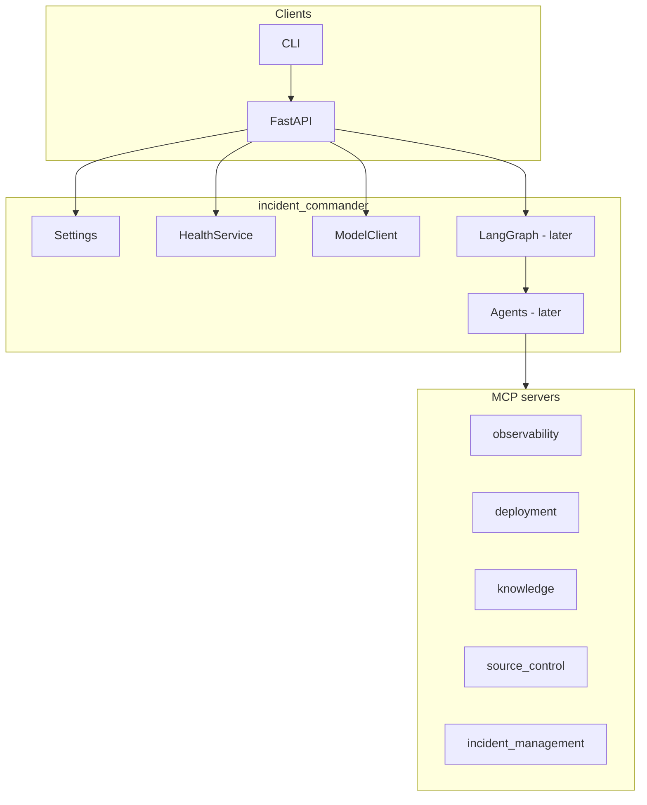

# Autonomous AI Incident Commander

An agentic incident-response platform that investigates production incidents
across logs, metrics, deployments, source code, runbooks, and prior tickets,
then produces an evidence-backed root-cause analysis and remediation plan.

> **Stages 1–2 are implemented.** Stage 1 provides the runnable foundation
> (health/readiness, settings, fake model). Stage 2 adds the typed domain model,
> phase-transition safety gates, and five complete synthetic incident scenarios.

## 1. Project overview

Users submit production incidents such as:

> Checkout errors increased after a recent deployment. Investigate the likely
> cause and recommend a safe response.

The system normalizes the report, investigates with specialized agents,
challenges hypotheses, estimates impact, and requires human approval before any
write or destructive action.

## 2. Why this project exists

Production incident response mixes noisy telemetry, tribal knowledge, and high
blast-radius actions. This repository demonstrates a senior-level approach to
**agentic systems with enforceable safety boundaries**: typed state, MCP tool
isolation, human-in-the-loop approvals, evaluation harnesses, and a path that
runs without a paid model API.

## 3. Architecture



See [docs/architecture/overview.md](docs/architecture/overview.md) and
[docs/architecture/domain-model.md](docs/architecture/domain-model.md).

## 4. Agent responsibilities

Fifteen specialized agents are planned (intake through safety/approval/report).
Stage 1 registers their names in `incident_commander.agents.AGENT_REGISTRY`.

## 5. LangGraph workflow

Planned flow: Intake → Planning → Topology → Parallel investigation → Evidence
aggregation → Hypotheses → Skeptic review → (optional reinvestigation) → Impact
→ Remediation → Safety → Human approval → Report.

Phase names live in `incident_commander.graph.WORKFLOW_PHASES` and are enforced
by `incident_commander.domain.transitions` (investigation cannot jump directly
to action execution; executable remediation requires approval).

## 6. MCP servers

| Server | Package | Stage 1 |
| --- | --- | --- |
| Observability | `servers/observability_mcp` | Tool metadata |
| Deployment | `servers/deployment_mcp` | Tool metadata (+ approval-gated rollback name) |
| Knowledge | `servers/knowledge_mcp` | Tool metadata |
| Source Control | `servers/source_control_mcp` | Tool metadata |
| Incident Management | `servers/incident_management_mcp` | Tool metadata |

## 7. Safety model

- Read-only and dry-run **on by default**
- No autonomous destructive actions
- Retrieved content treated as untrusted data
- Approval-denied errors reserved for write gating

See [docs/safety/threat-model.md](docs/safety/threat-model.md).

## 8. Human approval flow

Write tools (for example `execute_approved_rollback`) will require a valid,
unexpired human approval token. Stage 1 defines the safety posture and error
types; token issuance lands with the remediation graph.

## 9. Local setup

Requirements: Python 3.12+, Make, optional Docker.

```bash
python3 -m venv .venv
source .venv/bin/activate
make install-dev
cp .env.example .env
```

The default model provider is `fake` — **no API key required**.

## 10. Running sample incidents

Five synthetic scenarios are packaged under
`src/incident_commander/fixtures/scenarios/`:

| Scenario | Theme |
| --- | --- |
| `connection-pool-exhaustion` | DB pool reduced after deploy |
| `payment-service-timeout` | Client timeout below payment p95 |
| `feature-flag-misconfiguration` | Inventory flag enabled too early |
| `queue-saturation-retry-amplification` | Zero-backoff retry storm |
| `insufficient-evidence` | Unknown cause / weak signal |

```bash
make run
python -m incident_commander.cli list-scenarios
python -m incident_commander.cli show-scenario connection-pool-exhaustion --json
# later stages:
# python -m incident_commander.cli investigate --scenario connection-pool-exhaustion
```

Also:

```bash
python -m incident_commander.cli version
python -m incident_commander.cli info --json
```

See [docs/evaluation/scenarios.md](docs/evaluation/scenarios.md).

## 11. API examples

```bash
curl -s http://localhost:8000/health | jq
curl -s http://localhost:8000/ready | jq
```

OpenAPI docs: `http://localhost:8000/docs`

## 12. Evaluation methodology

Documented in [docs/evaluation/methodology.md](docs/evaluation/methodology.md).
Numbers will be produced from deterministic fixtures — never fabricated.

## 13. Results

No evaluation runs yet (agents/scenarios arrive in later stages).

## 14. Limitations

- Investigation graph and agents are not implemented yet
- MCP servers expose metadata only (no network tool handlers yet)
- Database/Redis readiness checks are opt-in and not wired
- Anthropic adapter does not call the live API until a transport is injected
- Scenario fixtures are static JSON; agents do not yet consume them in a live graph

## 15. Roadmap

1. **Stage 1** — Repository foundation *(done)*
2. **Stage 2** — Domain model + synthetic incident dataset *(done)*
3. MCP servers with fixture-backed tools
4. LangGraph workflow + 15 agents
5. Approval tokens, audit log, redaction
6. Evaluation harness and baseline comparisons
7. Persistence, OTEL, and richer CLI/API

## 16. Contributing

See [CONTRIBUTING.md](CONTRIBUTING.md), [CODE_OF_CONDUCT.md](CODE_OF_CONDUCT.md),
and [SECURITY.md](SECURITY.md).

## License

Apache License 2.0 — see [LICENSE](LICENSE).

## Development commands

| Command | Description |
| --- | --- |
| `make install-dev` | Editable install + dev tools |
| `make lint` | `ruff check .` |
| `make typecheck` | `mypy src` |
| `make test` | `pytest` |
| `make check` | lint + typecheck + test |
| `make run` | Start API on `:8000` |
| `make docker-up` | Compose: API + Postgres + Redis |
