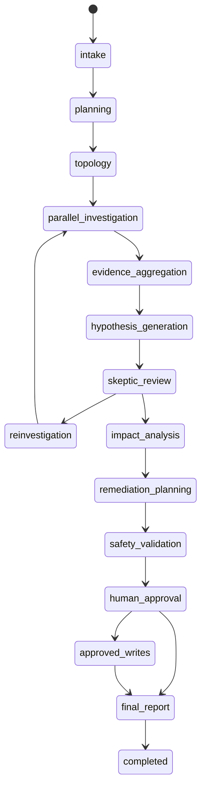

# Domain Model (Stage 2)

## Core types

| Model | Purpose |
| --- | --- |
| `Incident` | Normalized intake report |
| `IncidentState` | Shared LangGraph state |
| `Evidence` | Provenanced investigation finding |
| `Hypothesis` | Competing root-cause candidate |
| `InvestigationPlan` / `InvestigationStep` | Planner output |
| `ImpactAssessment` | Customer/system blast radius |
| `RemediationAction` / `ApprovalRequest` | Proposed actions + HITL gate |
| `ExecutionRecord` | Audit trail for writes |
| `FinalIncidentReport` | Facts vs inferences vs uncertainty |

## Reducers

Parallel investigators merge into shared state with:

- `reduce_evidence` — last-writer-wins by `evidence_id`
- `reduce_hypotheses` — last-writer-wins by `hypothesis_id`
- `append_unique_strings` — ordered de-duplication for missing evidence lists

## Phase transitions

Investigation phases cannot jump to `approved_writes`. Executable remediation
requires the `approved_writes` phase, an approved `ApprovalRequest` covering the
action, and a matching approval token.

