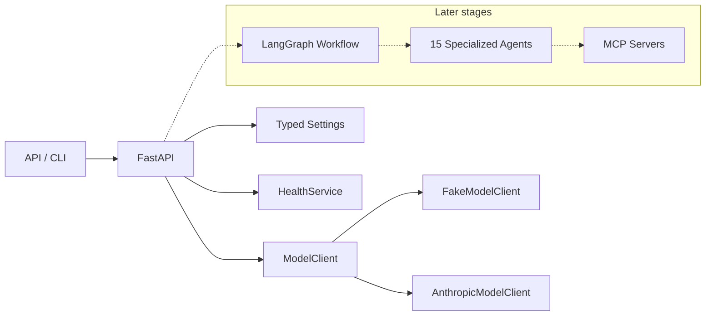

# Architecture Overview (Stage 1)

Autonomous AI Incident Commander is an agentic incident-response platform.

## High-level components

## Stage status

| Component | Status |
| --- | --- |
| Settings / logging / exceptions | Implemented |
| `GET /health`, `GET /ready` | Implemented |
| Fake model (default) | Implemented |
| Anthropic adapter interface | Implemented (no live prompts) |
| Domain model + `IncidentState` | Implemented (Stage 2) |
| Phase transitions / approval gates | Implemented (Stage 2) |
| Synthetic incident scenarios | Implemented (Stage 2) |
| LangGraph agents | Package reserved |
| MCP tool runtimes | Metadata registries only |
| Persistence / OTEL exporters | Package reserved |

## Dependency injection

The FastAPI app stores `settings`, `health_service`, and `model_client` on
`app.state` during `create_app()`. Route handlers retrieve them through
`incident_commander.api.deps` rather than importing globals.
